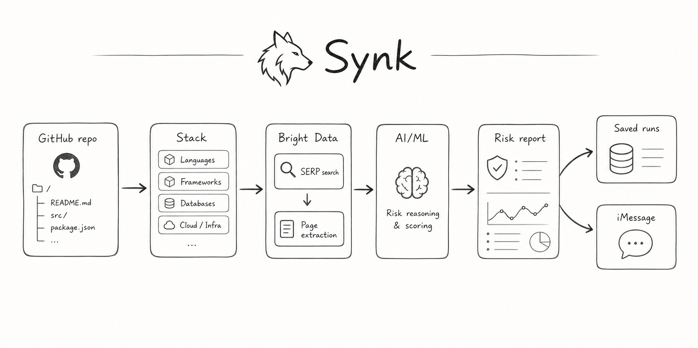

# Synk



Synk scans a GitHub repository, reads dependency and stack evidence, checks public threat, release, and deprecation signals, then turns the result into action-ready fixes a developer can paste into an IDE.

## What It Does

- Scans GitHub repository manifests and stack files.
- Uses Bright Data SERP and Web Unlocker for public CVE, exploit, advisory, release, and deprecation evidence.
- Uses AI/ML API through the Vercel AI SDK to normalize findings into strict risk records.
- Stores scan memory through Cognee, so the Advisor can reason over previous high-risk findings.
- Generates fix prompts and downloadable team reports from saved runs.

## Local Run

```bash
npm install
npm run build
npm run start -- --port 3100
```

Optional Cognee memory service:

```bash
npm run cognee:up
```

Required local environment names:

```dotenv
SERP_API_KEY=
WEBUNLOCKER_API_KEY=
AIMLAPI_API_KEY=
SPEECHMATICS_API_KEY=
COGNEE_SERVICE_URL=http://localhost:8000
COGNEE_DATASET_NAME=synk-memory
```

## Deploy On Render

This repo includes `render.yaml` for a Render Blueprint:

- `synk-web`: the public Next.js app.
- `synk-cognee`: an internal Cognee memory service.

The free Render Blueprint does not attach persistent disk storage to Cognee. Memory can reset after redeploys or restarts. For durable memory, enable Render billing and add a disk at `/app/cognee/.data_storage`.

In Render, fill these secrets when the Blueprint asks:

```dotenv
SERP_API_KEY=
WEBUNLOCKER_API_KEY=
AIMLAPI_API_KEY=
SPEECHMATICS_API_KEY=
LLM_API_KEY=
EMBEDDING_API_KEY=
```

Use the same AI/ML API key for `AIMLAPI_API_KEY`, `LLM_API_KEY`, and `EMBEDDING_API_KEY` unless you intentionally split providers.

Blueprint link after pushing this repo:

```text
https://dashboard.render.com/blueprint/new?repo=https://github.com/fozagtx/Synk
```
