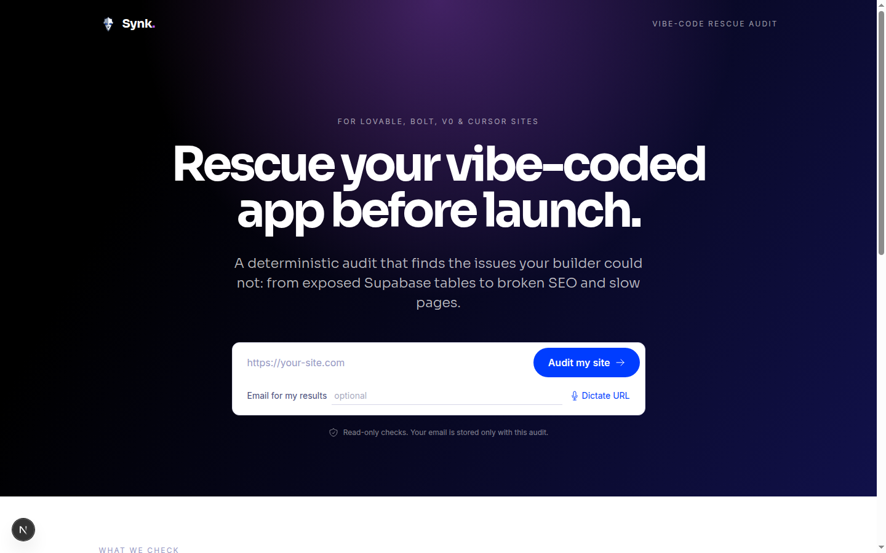
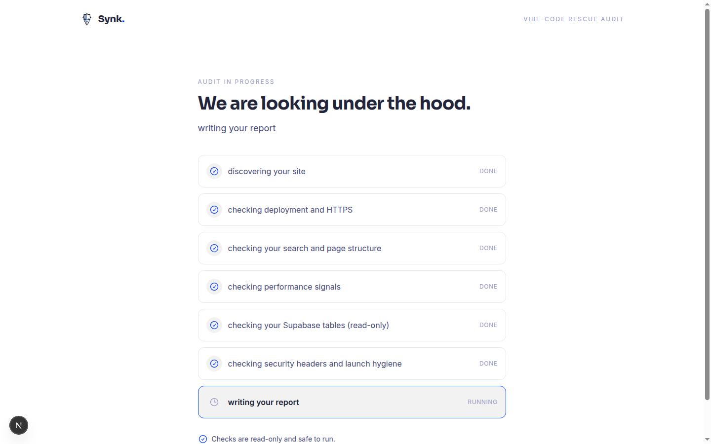
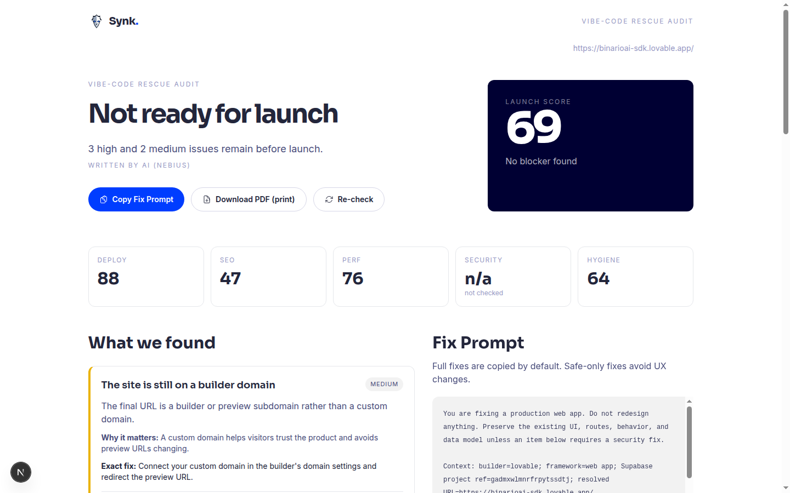

# Synk

Synk is a rescue audit for sites built with Lovable, Bolt, v0, or Cursor. You paste a URL. Synk crawls the live site, runs five independent checks, and writes a plain-English report that says what is broken, why it matters, and what to paste back into your builder to fix it.

No mocks. Every finding comes from a real HTTP request against the live site, and every finding carries the evidence that produced it.

## Screenshots

Live audit of a Lovable site with Firecrawl crawling and Nebius prose enabled.







## Contents

- [How it works](#how-it-works)
- [What it checks](#what-it-checks)
- [Scores and severities](#scores-and-severities)
- [The Fix Prompt](#the-fix-prompt)
- [Running locally](#running-locally)
- [Configuration](#configuration)
- [API](#api)
- [Deploying to Render](#deploying-to-render)
- [Project layout](#project-layout)
- [Limits in v1](#limits-in-v1)

## How it works

1. You submit a URL on the home page. Schemes are optional (`myapp.lovable.app` works).
2. `POST /api/audits` validates the URL, blocks private and local targets, and returns `202` with an audit id in under a second. The audit runs in the background.
3. The status page at `/a/:id` polls the audit and shows each step as it finishes.
4. Discovery fetches the page once, follows redirects, collects same-origin links, and downloads a sample of JavaScript bundles. If `FIRECRAWL_API_KEY` is set, Firecrawl also renders the page so JavaScript-only content is visible to the SEO check.
5. Five checks run in parallel, each with its own timeout. A check that fails or times out produces an explicit "could not check" finding. It never counts as a pass.
6. Scores, severities, evidence, and the Fix Prompt are computed deterministically from the findings. If `NEBIUS_API_KEY` is set, Nebius rewrites the human-facing sentences (headline, verdict, summary, why it matters, what to do). It cannot change ids, severities, scores, evidence, or SQL.
7. The report is served at `/r/:id`. Re-running the same URL with the "re-check" action compares the new findings with the previous audit and shows fixed, still open, and new items.

## What it checks

| Check | What it looks at |
| --- | --- |
| Deploy | HTTPS, redirect chain, builder preview domains, reachable routes, HTTP status of the root |
| SEO | Title, meta description, Open Graph and Twitter tags, canonical URL, robots.txt, sitemap, H1, image alt text, empty initial HTML |
| Performance | Sampled JavaScript weight, render-blocking scripts and styles, document size, compression, cache headers |
| Security (Supabase) | Detects the Supabase URL and anon key in bundles, reads the public OpenAPI schema, probes each table with `select=*&limit=1`, checks public storage buckets, flags exposed service-role keys |
| Hygiene | Content-Security-Policy, HSTS, X-Frame-Options, X-Content-Type-Options, source maps, mixed content, exposed `.env` and similar files, analytics scripts |

Performance is based on measurable HTTP signals only. Synk does not run Lighthouse and does not report LCP or Core Web Vitals.

## Scores and severities

Each finding has a severity: `blocker`, `high`, `medium`, `low`, or `info`. Each category score starts at 100 and loses points per finding: 40 for a blocker, 24 for high, 12 for medium, 5 for low, 0 for info. The overall score is the average of the scored categories. A category whose only findings are "could not check" gets no score and shows `n/a` in the report instead of a fake number.

Security evidence is redacted before it is stored: column names and types are kept, values are masked, and keys are shown as prefix and length only.

## The Fix Prompt

Every report ends with a Fix Prompt: a single block of text written for the builder that made the site (Lovable, Bolt, v0, Cursor, or a generic builder). Paste it into the builder's chat to fix the findings. Two variants are generated:

- **Safe**: changes that cannot break the site (metadata, headers, alt text, caching).
- **Full**: everything in Safe plus data-related fixes, including ready-to-run Supabase SQL that enables Row Level Security and adds owner policies for each table that leaked.

The SQL is generated from the structured table and column evidence, not from the prose.

## Running locally

Requirements: Node 20 or newer.

```sh
npm install
npm run dev
```

Open http://localhost:3000, paste a public URL, and wait for the report.

Useful scripts:

```sh
npm run lint      # eslint
npx tsc --noEmit  # typecheck
npm run test      # vitest
npm run build     # production build
```

Everything works with zero environment variables. Without keys, crawling uses server-side fetch and the report prose is deterministic.

## Configuration

Secrets are read once in `lib/env.ts`. Non-secret provider URLs and the model name live in `lib/config.ts` and are not environment variables.

| Variable | Required | What it enables |
| --- | --- | --- |
| `SPEECHMATICS_API_KEY` | No | Voice dictation of the URL on the home page via Speechmatics |
| `FIRECRAWL_API_KEY` | No | Rendered crawl of the home page and up to three subpages through Firecrawl. Falls back to fetch on error or rate limit |
| `NEBIUS_API_KEY` | No | Report prose written by the model in `lib/config.ts` (default `Qwen/Qwen3-30B-A3B-Instruct-2507`) through Nebius AI Studio. Falls back to deterministic prose on error |

The report shows which paths were used: `crawlSource` is `firecrawl` or `fetch`, and `proseSource` is `nebius` or `deterministic`. Provider errors are logged as structured JSON (`firecrawl_rate_limited`, `nebius_prose_unavailable`) with the response body.

## API

`POST /api/audits`

```json
{ "url": "myapp.lovable.app", "force": false }
```

Returns `202 { "id": "..." }`. Identical URLs within 15 minutes return the existing audit unless `force` is `true`.

`GET /api/audits/:id`

Returns the audit status, the step list, the report once it is done, and a comparison with the previous audit of the same URL when one exists.

Rejected targets: non-HTTP(S) schemes, `localhost`, loopback, private ranges, link-local addresses, and hosts that do not resolve.

## Deploying to Render

`render.yaml` defines one web service. Set the three API keys in the Render dashboard (they are marked `sync: false`). Nothing else needs to be configured.

## Project layout

```
app/                 Next.js App Router pages and API routes
  page.tsx           URL intake
  a/[id]/page.tsx    Status page
  r/[id]/page.tsx    Report page
  api/audits/        Start and read audits
  api/transcribe/    Speechmatics transcription
lib/audit/           Discovery, checks, scoring, report, Fix Prompt, storage
lib/crawl/           Firecrawl client
lib/llm/             Nebius prose writer
lib/config.ts        Provider URLs and model name
lib/env.ts           API keys
components/          UI
```

## Limits in v1

- Audits are stored in memory. A restart clears them.
- Supabase checks are read-only. Synk never inserts, updates, or deletes. At most 25 tables are probed, always with `limit=1`.
- One site is discovered per audit. Subpage sampling is capped to keep audits under about a minute.
- Builder detection uses the host, generator metadata, and bundle signatures. Cursor leaves no reliable trace on a deployed site, so Cursor projects get the generic Fix Prompt.

## License

MIT. See [LICENSE](LICENSE).
